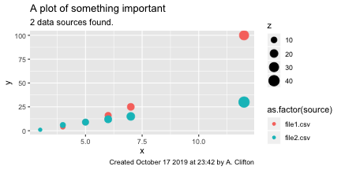

<!-- ## If you are reading the source code
This is R Markdown. Markdown is a simple formatting syntax for authoring HTML, PDF, and MS Word documents. For more details on using R Markdown see <http://rmarkdown.rstudio.com> or <http://kbroman.org/knitr_knutshell/pages/Rmarkdown.html>.

This script is designed to be used with knitr in R. -->

# Introduction

Something something reproducible research, mumble, grumble, get off my lawn, grumble.

## Linking analysis and publication workflows
Anecdotally, the separation of the publication from the analysis process has been a barrier to reproducible research, as it is impossible to ensure the link between source data and final publication.

This document demonstrates the application of Literate Programming to reproducible research [@Knuth1984]. Literate programming means that the program documentation is complete and contained within the program itself. It is important to note that the documentation is effectively a publication, and thus it is possible to combine data analysis with the creation of a publication in the same file. The use of literate programming therefore mitigates this barrier to reproducible research.

Furthermore, this project has been structured so that the data required for this publication are in a subdirectory of the project. This means that all of the files required to reproduce the analysis results can be included in a repository.

## How Literate Programming was used to write this document
In this example, an output PDF document and results are generated from a file called _main.rmd_. _main.rmd_ is an [R markdown file](https://rmarkdown.rstudio.com/authoring_basics.html). R markdown is a flavor of markdown that can be processed by the R programming language [@R-base] to run code (i.e, do analysis) and create documentation from the same document. This is done using a package called _knitr_. Instructions for how to run _knitr_ are included in the _howto.md_ file in this repository. A far more detailed guide to writing using R markdown can be found in @R-Markdown-Guide.

The markdown document contains a mixture of documentation -- written in markdown or LaTeX - and so-called ``code chunks'', which here are written in R. The output is a PDF.

 * The .rmd document is written in Pandoc markdown. It is possible to export [other types of markdown](https://bookdown.org/yihui/rmarkdown/markdown-document.html#markdown-variants), including GitHub flavored markdown.
 * The code chunks can be configured so that their outputs are echoed to the document (or not), which in turn allows the output PDF to show only those parts of the data processing that are relevant. You can thus completely hide the data operations in your output PDF and just concentrate on displaying the results.
 * It is possible to use other programming languages (see [``But I hate R''](#pleaseNotR))
 * There are a lot of different possible output formats, including PDF, HTML, Notebooks, and others. See [@R-Markdown-Guide] or  https://bookdown.org/yihui/rmarkdown/documents.html for more information.

I suggest reading this PDF together with the R markdown file (_main.rmd_) and possibly the _knitr_ instructions^[See https://yihui.name/knitr/]. This will greatly help in understanding what is done in the processing and what makes it to the publication.

<!-- ## Execute some code without displaying results. -->


## But I hate R {#pleaseNotR}
You don't mean that. But if you can't handle learning yet another new language, this next statement might interest you.

> "A less well-known fact about R Markdown is that many other languages are also supported, such as Python, Julia, C++, and SQL. The support comes from the knitr package, which has provided a large number of language engines.""
>
> --- @R-Markdown-Guide

The currently available language engines are:


```r
names(knitr::knit_engines$get())
```

```
##  [1] "awk"         "bash"        "coffee"      "gawk"        "groovy"     
##  [6] "haskell"     "lein"        "mysql"       "node"        "octave"     
## [11] "perl"        "psql"        "Rscript"     "ruby"        "sas"        
## [16] "scala"       "sed"         "sh"          "stata"       "zsh"        
## [21] "highlight"   "Rcpp"        "tikz"        "dot"         "c"          
## [26] "fortran"     "fortran95"   "asy"         "cat"         "asis"       
## [31] "stan"        "block"       "block2"      "js"          "css"        
## [36] "sql"         "go"          "python"      "julia"       "sass"       
## [41] "scss"        "theorem"     "lemma"       "corollary"   "proposition"
## [46] "conjecture"  "definition"  "example"     "exercise"    "proof"      
## [51] "remark"      "solution"
```

So, you have no excuse. You can simply write your code in any of the 52 languages, and off you go.

## Coding chunks

Let's do some coding in R:


```r
y = 40 + 2
print(y) 
```

```
## [1] 42
```

... and here's some python:


```python
y = 6 + 7
print(y) 
```

```
## 13
```

We have to be a bit careful as the python and r data are separate. The value of `y` in the R session is 42. It is not the same `y` as the one in python (13).

# Implementing a coupled analysis and publication workflow
An analysis and publication workflow usually follows a similar path:

1. Set up the computing environment
1. Load our own data processing routines
1. Import data
1. Plot it
1. Do some operations
1. Plot some more
1. Write.
1. Format for a journal
1. Iterate around items 1-9 for a while
1. Submit

Fortunately, all of this can be captured in a markdown document.

## Setting up the computing environment
Like most scripts, _main.rmd_ includes a few variables that the user must set to run the analysis.

 * The _project.root_ variable defines the location of the files required for this analysis.
 * The _made.by_ variable forms part of a label that will be added to the plots.

An advantage of _knitr_ is that we can simply execute the code and show the code and results inline:


```r
# Where can files be found?
project.root <- file.path('/Users/andyc/Documents/public/GitHub/LiterateDemo')
project.root

# Who ran this script
made.by = "A. Clifton"
made.by
```

```
## [1] "/Users/andyc/Documents/public/GitHub/LiterateDemo"
## [1] "A. Clifton"
```

We can also show the value of those variables in the documentation using backticks around the variable names in the markdown.

 * _project.root_ is /Users/andyc/Documents/public/GitHub/LiterateDemo
 * _made.by_  is A. Clifton.

We want to change our working directory (_working.dir_ ) to the root directory of the project. We've already set up several important subdirectories:

 * /__code__ contains functions required for the analysis
 * /__data__ contains the data files to be analyzed.

Let's tell the code where these are.


<!-- ## We now generate a directory (_output.dir_) to capture the outputs from this analysis.-->


We'll also create a new directory for the results of the analysis. In this case it can be found at __/Users/andyc/Documents/public/GitHub/LiterateDemo/analysis/all__.

**Note:** Packages are required to supplement base functions in R and many other languages. For example, this script requires the _reticulate_, _bookdown_, _ggplot2_, _grid_, _knitr_, _RColorBrewer_, _rgdal_, and _stringr_ packages to run. These are called from the script using the _require()_ function. This assumes that the packaages are available on your system.^[For details of how to install packages, see the RStudio help.] The use of packages represents a challenge to reproducable and repeatable research as it is possible that the function and output of the packages may change over time.


## Loading our own routines
Every data processing workflow requires its own scripts or functions to run. In this example, they are included in the _codes_ directory and sourced during the preparation of this document. I have included output below to show these codes being called.


```r
# source these functions
code.files = dir(code.dir, pattern = "\\.R$")
for (file in code.files){
  source(file = file.path(code.dir,file))
  print(paste0("Sourcing ", file, "."))
}
```

```
## [1] "Sourcing cleanPlot.R."
## [1] "Sourcing plotInfoLabel.R."
## [1] "Sourcing plotSomething.R."
## [1] "Sourcing theme_Literate.R."
```

## Load the data
We now analyse the data from the simple data set. In this case, code has been written to load all of the files in the _data.dir_   directory (/Users/andyc/Documents/public/GitHub/LiterateDemo/data). I'm also going to map the three columns in the data files to the variables $x$, $y$, and $z$.^[See https://www.calvin.edu/~rpruim/courses/s341/S17/from-class/MathinRmd.html for more information about including maths in R markdown]


## Plot input data
The next step is to plot the input data. In this case we plot all of the input data together in one plot, but there are many different possibilities. Figures can also be given a consistent look and feel through ggplot's themes.

<!-- Configure graphics -->


For convenience, we'll also save a copy of the figure as a _.png_ file to the _analysis_ directory.


## Operate on the data
At this point we can do any number of operations on the data. For sake of demonstration, let's add 2 to all $x$ values.


```r
df.all <- df.in
df.all$x <- df.in$x + 2.0
```

## Plot the results
Let's run that _plotSomething_ routine again.



And, as we can see, the data have shifted along $x$ by a small amount.

## Connect processing with publication
So far we have demonstrate that we can import and manipulate data and plot results. Another important part of a publication is the ability to generate statistics or summary information from data and include that in our text.

To demonstrate that, I can calculate that the maximum value of $y$ in the input data sets was 100. This can be confirmed by checking the input data files. I could also include more complex logic in these statements, for example to say if one statistic is bigger or larger than another.

We sometimes need to include formatted tables in documents. This can be done using the _kable_ function (Table \@ref(tab:dfall)).

<!--- https://bookdown.org/yihui/rmarkdown/bookdown-markdown.html#bookdown-markdown --->

```r
knitr::kable(df.all,
             format = "markdown",
             booktabs=TRUE,
             caption = "The df.all data frame.")
```


|  x|   y|  z|source    |
|--:|---:|--:|:---------|
|  3|   1|  3|file1.csv |
|  4|   4|  6|file1.csv |
|  5|   9|  9|file1.csv |
|  6|  16| 12|file1.csv |
|  7|  25| 15|file1.csv |
| 12| 100| 30|file1.csv |
|  3|   1|  4|file2.csv |
|  4|   6|  8|file2.csv |
|  5|   9| 12|file2.csv |
|  6|  12| 16|file2.csv |
|  7|  15| 20|file2.csv |
| 12|  30| 40|file2.csv |

## Save the processed data
We now write our processed data to file.


```r
# save the data
save(list = c("project.root",
              "made.by",
              "df.all"),
       file = file.path(output.dir,"Data.RData"),
       envir = .GlobalEnv)
```

In R it is also possible to save the whole workspace. We can do that here as well:


```r
# save the workspace
save.image(file=file.path(output.dir,"workspace.RData"))
```

## Saving packages
<!--- ? Is it possible to save packages locally the first time they are called and then pick them up there afterwards, instead of from a repo? --->

## Applying Journal formating
Scientific Journals often have their own formatting requirements. These requirements can still be met using markdown. The mechanics of such a process are beyond the scope of this paper and should probably be done as the last step in the publishing process. The reader is suggested to look at the _rticles_ package and to use the detailed instructions in section 13 of the R Markdown Guide [@R-Markdown-Guide].

# Conclusions
It is possible to write a single document that captures all of the process of preparing and analysing data and creating a publication to describe that data.

# Referencing this document {-}
This document has been assigned the Digital Object Identifier [10.5281/zenodo.3497450](http://dx.doi.org/10.5281/zenodo.3497450). Full citation information in a range of formats can be obtained through Zenodo.

[](https://doi.org/10.5281/zenodo.3497450)

The source code for this document is available through [github.com/AndyClifton/LiterateDemo](https://github.com/AndyClifton/LiterateDemo).

# Acknowledgements {-}

Many thanks to Nikola Vasiljevic at DTU for prompting me to get this done.

# Bibliography {-}
