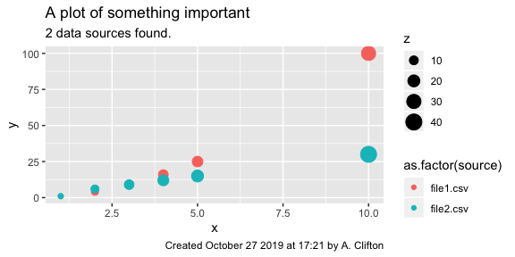
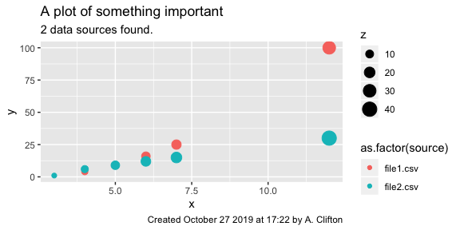

<!-- ## If you are reading the source code
This is R Markdown. Markdown is a simple formatting syntax for authoring HTML, PDF, and MS Word documents. For more details on using R Markdown see <http://rmarkdown.rstudio.com> or <http://kbroman.org/knitr_knutshell/pages/Rmarkdown.html>.

This script is designed to be used with knitr in R. -->

# Introduction

<!-- Something something reproducible research, mumble, grumble, get off my lawn, grumble. -->

Scientific progress is underpinned by the exchange of information
between scientists. This allows others to reuse methods, repeat work and
confirm – or refute – findings, and adds to the reputability of the
research. These ideals are sometimes lumped together under the heading
of \`\`reproducible research’’. As a result of applying these methods,
new developments can make their way into the body of knowledge.

Reproducible research is beneficial in many non-academic settings, for
example by showing that a consultant applied all relevant standards in
designing a product, or during an audit when it can be used to show
conformance to business processes.

Reproducible research is however often just a goal, rather than a
reality. For example, analysis processes are often separated from
publication because of the need to switch software. Analysis might be
done using python, Fortran, Matlab, or any number of tools, while the
writing might be done using LaTeX, a desktop publishing software, or
something else. The use of multiple software types means that there is a
disconnect between the two steps; it is possible that the published
document does not actually accurately represent the data. This is not,
then, reproducible research.

Recent growth in the capabilities of data repositories such as GitHub
and Zenodo means that is feasible to store data and documents together
and share them. This assists in sharing data and algorithms and thus
replicating research, but the disconnect between data and publication
persists. What is therefore needed is a method to clearly link data,
algorithms, and publications, and allow that to be shared. This would be
beneficial to many people.

## Linking analysis and publication workflows

This document demonstrates the application of Literate Programming to
reproducible research. Literate programming means that the program
documentation is complete and contained within the program itself (Knuth
1984)\[1\]. It is important to note that the documentation is
effectively a publication, and thus it is possible to combine data
analysis with the creation of a publication in the same file. The use of
literate programming therefore mitigates this barrier to reproducible
research.

A literate program could be stored together with the input files,
processing algorithms, and output documents in a repository. That
repository could be shared with others directly who can then use the
contents however they need. As an example, the document that you are
reading has been archived in a GitHub repository, and can be downloaded
and used by anyone to replicate the output documents. Later in this
document I will explore some different ways of storing and distributing
such information depending on confidentiality requirements.

## How Literate Programming was used to write this document

In this example, an output PDF document and results are generated from a
file called *main.rmd*. *main.rmd* is an [R markdown
file](https://rmarkdown.rstudio.com/authoring_basics.html).

R markdown is a flavor of markdown – basically pandoc – that can be
processed by the R programming language (R Core Team 2017) to run code
(i.e, do analysis) and create documentation from the same document. It
looks like normal text and the markdown document contains a mixture of
documentation and \`\`code chunks’’.

The code chunks look like this:

    ```{r, echo=TRUE}
    y = 40 + 2
    print(y)
    ```

.. which evaluates to

``` r
y = 40 + 2
print(y)
```

    ## [1] 42

The code chunks above are written in R. They are evaluated at the time
the document is processed. This is enabled by the *knitr* package, which
also includes support for other languages (See section
@ref(sec:pleaseNotR)). Code chunks can be configured so that their
outputs are echoed to the document (or not). You can thus completely
hide data wrangling operations in your output PDF and just display
results.

Pandoc supports raw latex, and so we can also leverage all of the
capabilities of LaTeX, but care should be taken not to start loading
lots of latex packages; you need to remember the limitations of your
output formats.

There are a lot of different possible output formats, including PDF,
HTML, Notebooks, other markdown formats, and many others. Corporate
formatting can usually be applied without modifying their content. The
details of this are out of scope for this paper; instead, see Xie,
Allaire, and Grolemund (2019) or
<https://bookdown.org/yihui/rmarkdown/documents.html> for more
information.

Instructions for how to run process (render) *main.rmd* are included in
the *HOWTO.md* file in this repository. A far more detailed guide to
writing using R markdown can be found in Xie, Allaire, and Grolemund
(2019).

There is a learning curve to all of this. I suggest reading this PDF
together with the R markdown file (*main.rmd*) and possibly the *knitr*
package’s instructions\[2\]. This will greatly help in understanding
what is done in the processing and what makes it to the publication.

<!-- ## Execute some code without displaying results. -->

## Please not R

If you can’t handle learning yet another new language, this statement
might interest you:

> “A less well-known fact about R Markdown is that many other languages
> are also supported, such as Python, Julia, C++, and SQL. The support
> comes from the *knitr* package, which has provided a large number of
> language engines.”
> 
> — Xie, Allaire, and Grolemund (2019)

You can use the other programming languages by replacing the \`\` {r, ’’
in the code chunk with the name of another language. The currently
available language engines are:

``` r
require(knitr)
names(knitr::knit_engines$get())
```

    ##  [1] "awk"         "bash"        "coffee"      "gawk"        "groovy"     
    ##  [6] "haskell"     "lein"        "mysql"       "node"        "octave"     
    ## [11] "perl"        "psql"        "Rscript"     "ruby"        "sas"        
    ## [16] "scala"       "sed"         "sh"          "stata"       "zsh"        
    ## [21] "highlight"   "Rcpp"        "tikz"        "dot"         "c"          
    ## [26] "fortran"     "fortran95"   "asy"         "cat"         "asis"       
    ## [31] "stan"        "block"       "block2"      "js"          "css"        
    ## [36] "sql"         "go"          "python"      "julia"       "sass"       
    ## [41] "scss"        "theorem"     "lemma"       "corollary"   "proposition"
    ## [46] "conjecture"  "definition"  "example"     "exercise"    "proof"      
    ## [51] "remark"      "solution"

So, you have no excuse. You can write your code in any of those 52
languages, and off you go.

The only challenge that might arise is that the document is
*R-flavoured* markdown. This means that it needs to be rendered from
within R, but that step can be dealt with relatively easily, for example
leveraging online resources such as the stackoverflow network.

# Implementing a coupled analysis and publication workflow

Let’s assume that you have formed a hypothesis and gathered a bunch of
data to test it. You now want to analyse that data and create a report
or article that summarizes your findings. An analysis and publication
workflow usually follows a similar path:

1.  Set up the computing environment
2.  Load some external packages
3.  Load our own data processing routines
4.  Import data
5.  Plot it
6.  Do some operations
7.  Plot some more
8.  Write
9.  Save
10. Iterate around items 1-9 for a while
11. Format for publication
12. Submit

All of this can be captured in our *main.rmd* R Markdown file, with the
exception of the final \`\`submit’’ stage.

## Setting up the computing environment

Like most scripts, *main.rmd* includes a few variables that the user
must set to run the analysis.

  - The `base.dir` variable defines the location of the files required
    for this analysis.
  - The `made.by` variable forms part of a label that will be added to
    the plots.

An advantage of using markdown and the *knitr* package is that we can
execute the code and show the code and results inline:

``` r
# Where can files be found?
base.dir <- file.path(getwd())
#base.dir <-file.path('.')
base.dir

# Who ran this script
made.by = "A. Clifton"
made.by
```

    ## [1] "/Users/andyc/Documents/public/Github/lit-pro-sci-pub-demo"
    ## [1] "A. Clifton"

We can also show the value of those variables in the documentation. For
example:

  - `base.dir` is
    /Users/andyc/Documents/public/Github/lit-pro-sci-pub-demo
  - `made.by` is A. Clifton.

Imagine that when we started our project, we set up several
subdirectories in `base.dir`. These are:

  - *code/* contains functions required for the analysis
  - *data/* contains the data files to be analyzed.

Let’s tell the code where to find these directories. And, while we do
it, we can also change R’s working directory (`working.dir`) to the root
directory of the project.

``` r
# define the working directory
working.dir <- base.dir
setwd(working.dir)
#identify data directory
data.dir = "data"
#identify code directory
code.dir = "code"
```

We now want to create a new directory for the results of the analysis.

Looking at your file system, you’ll see there is now a new directory
called *analysis*.

## Load packages

Packages are required to supplement base functions in R and many other
languages. For example, this script requires the *reticulate*,
*bookdown*, *ggplot2*, *grid*, *knitr*, *RColorBrewer*, *rgdal*, and
*stringr* packages to run. These are called from the script using the
`require()` function. This assumes that the packages are available on
your system.\[3\]

\*\* Note: \*\* The use of packages represents a challenge to
reproducable and repeatable research as it is possible that the function
and output of the packages may change over time.

## Loading our own routines

Every data processing workflow requires its own scripts or functions to
run. In this example, they are included in the `code.dir` (*code*)
directory and sourced during the preparation of this document. I have
included output below to show these codes being called.

``` r
# source these functions
code.files = dir(file.path(base.dir,code.dir), pattern = "\\.R$")
for (file in code.files){
  source(file = file.path(base.dir,code.dir,file))
  print(paste0("Sourcing ", file, "."))
}
```

    ## [1] "Sourcing cleanPlot.R."
    ## [1] "Sourcing plotInfoLabel.R."
    ## [1] "Sourcing plotSomething.R."
    ## [1] "Sourcing theme_Literate.R."

## Load the data

We now analyse the data from the simple data set. In this case, code has
been written to load all of the files in the `data.dir` directory
(data). I’m also going to map the three columns in the data files to the
variables \(x\), \(y\), and \(z\).\[4\]

## Plot input data

The next step is to plot the input data. Let’s plot all of the input
data together using the `plotSomething()` function in the `code.dir`
directory.



I’ve used the `ggplot2` package to make this figure. This has the
advantage that figures can be given a consistent look and feel through
ggplot’s themes.

For convenience, we’ll also save a copy of the figure as a *.png* file
to the `output.dir` (*analysis/*) directory.

## Operate on the data

At this point we can do any number of operations on the data. For sake
of demonstration, let’s add 2 to all \(x\) values.

``` r
df.all <- df.in
df.all$x <- df.in$x + 2.0
```

## Plot the results

Let’s run that `plotSomething()` routine again.



And, as we can see in Figure @ref(fig:plot-modified-data), the data have
shifted along \(x\) by a small amount.

## Write

Writing in an R Markdown document is similar to most other types of
markdown.

So far we have demonstrate that we can import and manipulate data and
plot results. Another important part of a publication is the ability to
generate statistics or summary information from data and include that in
our text.

To demonstrate that, I can calculate that the maximum value of \(y\) in
the input data sets was 100. This can be confirmed by checking the input
data files. I could also include more complex logic in these statements,
for example to say if one statistic is bigger or larger than another.

I can also include equations, and reference them (e.g. Equation
@ref(eq:eq)). This gets weird, because for the best results with
equations we should now use LaTeX-style `\begin{equation}...
\end{equation}`:

\[
(\#eq:eq)
A=\frac{\pi}{27d^2}
\]

(I’ve tried using `$$` here, and it doesn’t work.)

You’ve already seen citations (R Core Team 2017), which refers to bibtex
entries in [*main.bib*](main.bib). These first appeared in section
@ref(sec:intro). Footnotes work too.\[5\]

We sometimes need to include formatted tables in documents. This can be
done using the `kable()` function (Table @ref(tab:dfall)).

``` r
knitr::kable(df.all,
  format="pandoc",
  caption = "The _df.all_ data frame.")
```

|  x |   y |  z | source    |
| -: | --: | -: | :-------- |
|  3 |   1 |  3 | file1.csv |
|  4 |   4 |  6 | file1.csv |
|  5 |   9 |  9 | file1.csv |
|  6 |  16 | 12 | file1.csv |
|  7 |  25 | 15 | file1.csv |
| 12 | 100 | 30 | file1.csv |
|  3 |   1 |  4 | file2.csv |
|  4 |   6 |  8 | file2.csv |
|  5 |   9 | 12 | file2.csv |
|  6 |  12 | 16 | file2.csv |
|  7 |  15 | 20 | file2.csv |
| 12 |  30 | 40 | file2.csv |

The *df.all* data frame.

If our goal was just to produce HTML, we could add styling, too. This is
detailed in the *kable* package vignettes.\[6\]

## Save

We now write our processed data to file.

``` r
# save the data
save(list = c("base.dir",
              "made.by",
              "df.all"),
       file = file.path(base.dir, output.dir, "Data.RData"),
       envir = .GlobalEnv)
```

In R it is also possible to save the whole workspace. We can do that
here as well:

``` r
# save the workspace
save.image(file=file.path(base.dir, output.dir,"workspace.RData"))
```

<!--- ? Is it possible to save packages locally the first time they are called and then pick them up there afterwards, instead of from a repo? --->

## Iterate

To re-run the analysis, render *main.rmd* every so often following the
instructions in *HOWTO.md*.

Some IDEs also allow the code chunks to be evaluated separately, which
might help when dealing with larger data sets, more complex analysis, or
bigger documents.

## Apply formatting

Scientific Journals often have their own formatting requirements. These
requirements can still be met using markdown. The mechanics of such a
process are beyond the scope of this paper and should probably be done
as the last step in the publishing process. The reader is encouraged to
look at the [*rticles*](https://github.com/rstudio/rticles) package and
to use the detailed instructions in section 13 of the R Markdown Guide
(Xie, Allaire, and Grolemund 2019).

# Does this approach lead to reproducable research?

If you would like to test the reproducibility of this approach, try
this:

1.  Make sure you have set up the computing environment.
2.  Make a copy of the entire working directory. Put that somewhere
    safe.
3.  In the working directory, remove the results:
    1.  Delete the *analysis* directory.
    2.  Delete the *publications/* directory and all of its
        subdirectories. This is where *main.PDF*, *main.html*, and
        *main.md* are.

You should now be left with some raw data and a few codes. There’s no
documentation anymore and no results.

5.  Render *main.rmd*. There are instructions on how to do this in the
    *HOWTO.md* file included in the root directory of the repository.

You now should have your data folder back and all of the documentation,
but you’ll notice that the dates on the figures might have changed. This
is reproducable research in action.

## Protecting confidential data and intellectual property

In an ideal world, I would simply throw all of my data and code into a
directory, push it to Github or some other repository, and share the URL
with everyone. This is effectively what you are reading.

Unfortunately, things don’t work that way. My data might be commercially
sensitive, and my algorithms represent intellectual property. As a
result, both data and codes might need to be protected. But the story is
not so clear cut. It may be helpful at this point to consider a few
real-world users and their needs, and how they might modify the above
processes to protect their data and intellectual property.

There are doubtless many other issues and anyone concerned about this is
encouraged to consult an expert.

### The academic researcher

… is driven by the need for recognition and cooperation, and wants to
share all of their processes and results.

There are two subsets here that we should remember:

  - the academic researcher who is required to share their data as a
    condition of their funding.
  - the academic researcher that cannot share their raw data as it was
    provided by an industry partner.

> “need to finish this”

### The consultant

… wants to provide scientifically rigorous results to clients without
sharing all of the algorithms that go into those results. However, they
might be subject to audits that require them to connect end results to
processing routines and data, and recreate those steps if required. This
is particularly relevant if processes are occasionally recalibrated.

> “need to finish this”

### The internal researcher

… wants to generate a record of research for internal purposes

This document gave a simple example where data was obtained from text
files that are stored in the same repository. However, it’s equally
possible that the raw data would have been called from a remote database
at run time (or cached) and should be kept confidential.

This can be done by not saving them to file. It would be desirable
instead to store data IDs that would allow traceability. This could be
combined with saving the results of the data processing, rather than the
raw data.

> “need to finish this”

## Is this FAIR?

\`\`FAIR’’ data stands for data that are Findable, Accessible,
Interoperable, and Reusable.

> “need to finish this”

### Interoperable data

Our data were stored as comma-separated values in .csv files. These are
not ideal; besides the meaningless column headers, there’s no metadata.
Instead, it would be ideal if the data had been in some kind of
self-describing format. It would have been even better if I knew which
industry I was targeting and had been able to use a standardized format.
This is left to the reader as an exercise\!

## Making the results portable

One way to ensure repeatability and reproducability may be to have a
generic \`\`data processing’’ image of a computer system, e.g. as a
Docker image, that is started for each new project and used *only* for
that project. This clean system is then used for one data processing
task which is managed through a file such as the one you are reading.
When the project is complete, the image is simply stored for as long as
required. This would also avoid problems associated with changes
introduced by package and system updates. A drawback to this approach
would be the need to migrate the data every 5 years or so to a new
system, which would be required to avoid data being stranded on old
software.

> “need to finish
this”

<!--- Algorithms could be called directly from third party services or accessed via APIs. This shifts the onus to those third parties to provide the tracking required for auditting, but does preserve intellectual property. --->

# Conclusions

Literate programming allows the creation of a single document that
captures all of the process of preparing and analysing data, and
creating a publication to describe that data. This is a fundamental
requirement of reproducible research.

# Referencing this document

This document has been assigned the Digital Object Identifier
[10.5281/zenodo.3497450](http://dx.doi.org/10.5281/zenodo.3497450).
Citations in a range of formats can be obtained through Zenodo.

[](https://doi.org/10.5281/zenodo.3497450)

The source code for this document is available through
[github.com/AndyClifton/lit-pro-sci-pub-demo](https://github.com/AndyClifton/lit-pro-sci-pub-demo).

# Acknowledgements

Many thanks to Nikola Vasiljevic at DTU for prompting me to get this
done.

# Bibliography

<div id="refs" class="references">

<div id="ref-Knuth1984">

Knuth, Donald E. 1984. “Literate Programming.” *The Computer Journal* 27
(2). British Computer Society: 97–111.

</div>

<div id="ref-R-base">

R Core Team. 2017. *R: A Language and Environment for Statistical
Computing*. Vienna, Austria: R Foundation for Statistical Computing.
<https://www.R-project.org/>.

</div>

<div id="ref-R-Markdown-Guide">

Xie, Yihui, J. J. Allaire, and Garrett Grolemund. 2019. *R Markdown: The
Definitive Guide*. <https://bookdown.org/yihui/rmarkdown/>.

</div>

</div>

1.  Yes, that’s the same \`Knuth’ who invented LaTeX

2.  See <https://yihui.name/knitr/>

3.  For details of how to install packages, see the RStudio help.

4.  See
    <https://www.calvin.edu/~rpruim/courses/s341/S17/from-class/MathinRmd.html>
    for more information about including maths in R markdown

5.  See what I did there?

6.  In this example I have explicitly stated `_format="pandoc"_` so that
    this file will work in HTML and PDF.
